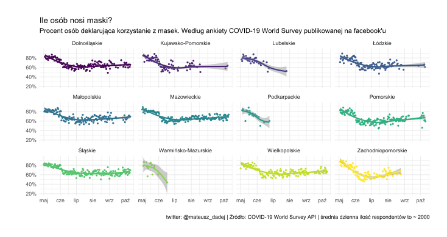
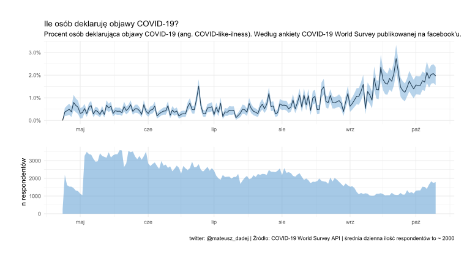

### Wrapper functions for extracting World COVID-19 World Survey Data gathered by University of Maryland and Facebook

Clone it or use `source("https://raw.githubusercontent.com/SquintRook/WC19SD/master/api_functions.R")`
to import functions to get data.

Documentation of the API along with description of variables is [here](https://covidmap.umd.edu/api.html)

Main function to get survey data:
```R
covid_survey(indicator = "mask",      # one of "covid" , "flu" , "mask" ,"contact", "finance" or "all"
             type = "daily",          # or "smoothed"
             country = "Poland",      # "United%" For countries with united in title
             region = "all",          # or c() in order to get total for a country
             date_range = "all")      # YYYY-MM-DD
```

Function to lookup available dates or countries/regions

```R
lookup_dates(country = c("Poland", "Pomorskie")) # to get available dates for Pomorskie region of Poland. Format c("country", "region")

lookup_country(region = TRUE) # to get list of available countries and regions if region = TRUE

```

Here are some visualizations of the data (in polish tho):





### Authors of the API itself:

Junchuan Fan, Yao Li, Kathleen Stewart, Anil R. Kommareddy, Adrianne
Bradford, Samantha Chiu, Frauke Kreuter, Neta Barkay, Alyssa Bilinski,
Brian Kim, Roee Eliat, Tal Galili, Daniel Haimovich, Sarah LaRocca,
Stanley Presser, Katherine Morris, Joshua A Salomon, Elizabeth A.
Stuart, Ryan Tibshirani, Tali Alterman Barash, Curtiss Cobb, Andres
Garcia, Andi Gros, Ahmed Isa, Alex Kaess, Faisal Karim, Ofir Eretz
Kedosha, Shelly Matskel, Roee Melamed, Amey Patankar, Irit Rutenberg,
Tal Salmona, David Vannette (2020). COVID-19 World Symptom Survey Data
API
